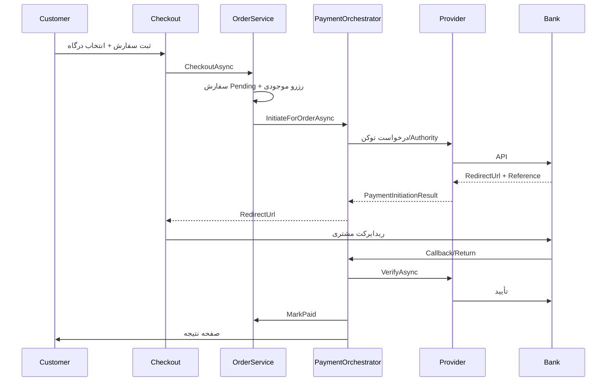

# درگاه‌های پرداخت

این سند راه‌اندازی، پیکربندی و عیب‌یابی درگاه‌های پرداخت ایرانی در Mirka CMS Shop را توضیح می‌دهد.

## معماری

### موجودیت‌ها

| موجودیت | توضیح |
|---------|--------|
| `PaymentProviderConfig` | تنظیمات هر درگاه (نام، فعال/غیرفعال، sandbox، تنظیمات رمزنگاری‌شده) |
| `PaymentAttempt` | هر تلاش پرداخت برای یک سفارش (ReferenceId، وضعیت، payload بازگشت) |

### URLها

- **Callback (سرور به سرور / بازگشت بانک):** `{baseUrl}/shop/payment/callback/{provider}`
- **Return (نمایش نتیجه به مشتری):** `{baseUrl}/shop/payment/return/{provider}?orderId={guid}`

مقادیر `{provider}`: `zarinpal`, `zibal`, `sep`, `mellat`, `snappay`

---

## راه‌اندازی ادمین

1. از **فروشگاه → درگاه‌های پرداخت** وارد شوید.
2. درگاه مورد نظر را **ویرایش** کنید.
3. فیلدهای لازم را پر کنید (Merchant ID، Terminal ID و …).
4. در حالت تست **Sandbox** را فعال کنید.
5. **Callback URL** نمایش‌داده‌شده در فرم را در پنل درگاه بانک ثبت کنید.
6. درگاه را **فعال** کنید.
7. در **تنظیمات فروشگاه** گزینه «پرداخت آنلاین» را فعال کنید.

مشتری در checkout با انتخاب «پرداخت آنلاین»، یکی از درگاه‌های فعال را می‌بیند.

---

## راهنمای هر درگاه

### ۱. زرین‌پال (Zarinpal)

| فیلد | الزامی | توضیح |
|------|--------|--------|
| Merchant ID | بله | از پنل زرین‌پال |
| Sandbox | — | `sandbox.zarinpal.com` برای تست |

**API:** REST v4  
- Initiate: `POST .../pg/v4/payment/request.json`  
- Redirect: `https://www.zarinpal.com/pg/StartPay/{authority}`  
- Verify: `POST .../pg/v4/payment/verify.json`

**Callback params:** `Authority`, `Status` (مقدار `OK` برای موفق)

**تست sandbox:** Merchant ID تست از مستندات زرین‌پال.

---

### ۲. زیبال (Zibal)

| فیلد | الزامی | توضیح |
|------|--------|--------|
| Merchant ID | بله | کد پذیرنده زیبال |

**API:**  
- Request: `POST https://gateway.zibal.ir/v1/request`  
- Start: `https://gateway.zibal.ir/start/{trackId}`  
- Verify: `POST https://gateway.zibal.ir/v1/verify`

**Callback params:** `trackId`, `success` (`1` = موفق)

---

### ۳. سپ / سامان (SEP)

| فیلد | الزامی | توضیح |
|------|--------|--------|
| Terminal ID | بله | شماره ترمینال |

**API:** Token-based  
- دریافت token → ریدایرکت به `sep.shaparak.ir`  
- Verify با `RefNum`

**Callback params:** `RefNum`, `State`

**ResNum:** شناسه attempt برای idempotency.

---

### ۴. به‌پرداخت ملت (Mellat)

| فیلد | الزامی | توضیح |
|------|--------|--------|
| Terminal ID | بله | شماره ترمینال |
| Username | بله | نام کاربری درگاه |
| Password | بله | رمز درگاه |

**API:** SOAP — `https://bpm.shaparak.ir/pgwchannel/services/pgw`  
- `bpPayRequest` → RefId  
- `bpVerifyRequest`  
- `bpSettleRequest` (در صورت نیاز)

**Callback params:** `RefId`, `ResCode`, `SaleOrderId`, `SaleReferenceId`

---

### ۵. اسنپ‌پی (SnapPay)

| فیلد | الزامی | توضیح |
|------|--------|--------|
| Client ID | بله | از پنل merchant |
| Client Secret | بله | |
| Username | بله | |
| Password | بله | |

**تفاوت:** BNPL/اقساطی — در checkout به‌عنوان روش «اسنپ‌پی» جدا نمایش داده می‌شود (نه زیر لیست درگاه‌های کارت بانکی).

**API:** OAuth token → create payment → verify

---

## امنیت

- تنظیمات حساس با **ASP.NET Data Protection** رمزنگاری و در `EncryptedSettings` ذخیره می‌شوند.
- **HTTPS** در production الزامی است.
- Secretها را در log قرار ندهید.
- Callback باید publicly reachable باشد (در dev از ngrok/tunnel استفاده کنید).

---

## عیب‌یابی

| مشکل | علت محتمل | راه‌حل |
|------|-----------|--------|
| سفارش Pending می‌ماند | callback نرسیده یا verify شکست خورده | URL callback، HTTPS، log `PaymentAttempt` |
| callback تکراری | رفتار عادی بانک | verify idempotent است؛ سفارش Paid دوباره پردازش نمی‌شود |
| mismatch مبلغ | واحد ریال | مبلغ verify باید با `order.TotalAmount` (ریال، بدون اعشار) برابر باشد |
| «درگاه فعال نیست» | toggle ادمین | درگاه را فعال و credentials را کامل کنید |
| initiate ناموفق | credentials یا sandbox | sandbox flag و Merchant/Terminal را بررسی کنید |

---

## چک‌لیست production

- [ ] HTTPS فعال
- [ ] Callback URL در پنل هر درگاه ثبت شده
- [ ] Sandbox غیرفعال
- [ ] credentials واقعی و رمزنگاری‌شده در DB
- [ ] حداقل یک درگاه فعال
- [ ] «پرداخت آنلاین» در تنظیمات فروشگاه فعال
- [ ] تست end-to-end با مبلغ کم
- [ ] مهلت پرداخت (`PendingPaymentTimeoutMinutes`) مناسب تنظیم شده

---

## توسعه

| لایه | فایل‌های کلیدی |
|------|----------------|
| Application | `IPaymentProvider`, `PaymentProviderContracts.cs` |
| Shop | `PaymentOrchestrator`, `PaymentConfigService`, `PaymentController` |
| Infrastructure | `Providers/ZarinpalPaymentProvider.cs`, … |
| Admin | `PaymentProvidersController` |

برای افزودن درگاه جدید: enum `PaymentProviderType`، implementation `IPaymentProvider`، seed در `PaymentConfigService`، فرم ادمین.
